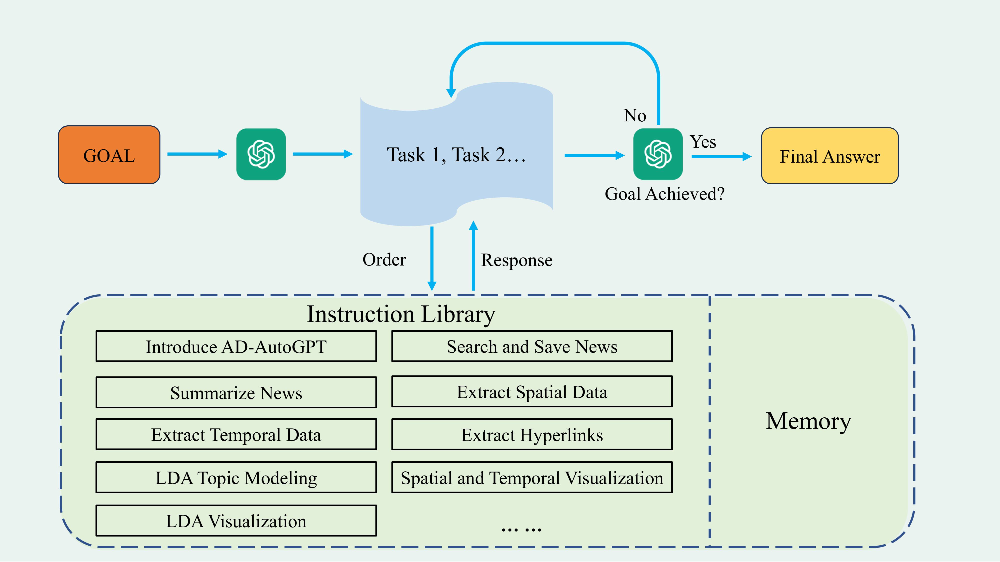

# AD-AutoGPT: An Autonomous GPT for Alzheimer's Disease Infodemiology
\[In submission\] Code for: [AD-AutoGPT: An Autonomous GPT for Alzheimer's Disease Infodemiology](https://arxiv.org/abs/2306.10095)

In this pioneering study, inspired by AutoGPT, the state-of-the-art open-source application based on the GPT-4 large language model, we develop a novel tool called AD-AutoGPT which can conduct data collection, processing, and analysis about complex health narratives of Alzheimer's Disease in an autonomous manner via users' textual prompts. We collated comprehensive data from a variety of news sources, including the Alzheimer's Association, BBC, Mayo Clinic, and the National Institute on Aging since June 2022, leading to the autonomous execution of robust trend analyses, intertopic distance maps visualization, and identification of salient terms pertinent to Alzheimer's Disease. This approach has yielded not only a quantifiable metric of relevant discourse but also valuable insights into public focus on Alzheimer's Disease. This application of AD-AutoGPT in public health signifies the transformative potential of AI in facilitating a data-rich understanding of complex health narratives like Alzheimer's Disease in an autonomous manner, setting the groundwork for future AI-driven investigations in global health landscapes.


Our framework is as follows.




## :hammer_and_wrench: Requirements

```python3
git clone https://github.com/levyisthebest/AD-AutoGPT.git
pip install -r requirements.txt
```

## Dataset 
All data is public data on the network, and the data automatically collected by the program will be saved in the workplace directory. The program itself contains the data used in the paper.

## How to run

 First, you need to set up the environment, then you can start using AD-AutoGPT. 


To run the model/method:
    
     .\run.bat  or sh run.sh


## Citation
@article{dai2023ad,
  title={AD-AutoGPT: An Autonomous GPT for Alzheimer's Disease Infodemiology},
  author={Dai, Haixing and Li, Yiwei and Liu, Zhengliang and Zhao, Lin and Wu, Zihao and Song, Suhang and Shen, Ye and Zhu, Dajiang and Li, Xiang and Li, Sheng and others},
  journal={arXiv preprint arXiv:2306.10095},
  year={2023}
}
